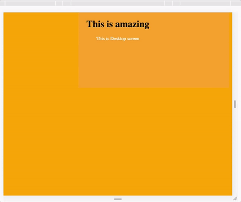

# scss-mixins

## its handy way to have SCSS useful mixins to use responsive layout.

```CSS
    @mixin bp-xxs-max {
      @media only screen and (max-width: $screen-xxs-max){
        @content;
      }
    }

    @mixin bp-xs-max {
         @media only screen and (max-width: $screen-xs-max){
            @content;
        }
    }
    @mixin bp-sm-max {
         @media only screen and (max-width: $screen-sm-max){
            @content;
        }
    }
    @mixin bp-md-max {
         @media only screen and (max-width: $screen-md-max){
            @content;
        }
    }
    @mixin bp-lg-max {
         @media only screen and (max-width: $screen-lg-max){
            @content;
        }
    }
```

In your scss file you can use is above mixing such as 

```CSS
    body{

      @include bp-md-max{
        background: orange;
        @include transitions(0.4s);
      }

      @include bp-sm-max{
        background: green;
        @include transitions(0.4s);
      }

      @include bp-xs-max{
        background: red;
        @include transitions(0.4s);
      }

      @include bp-xxs-max{
        background: pink;
        @include transitions(0.4s);
      }
    }
```





 

   
   


